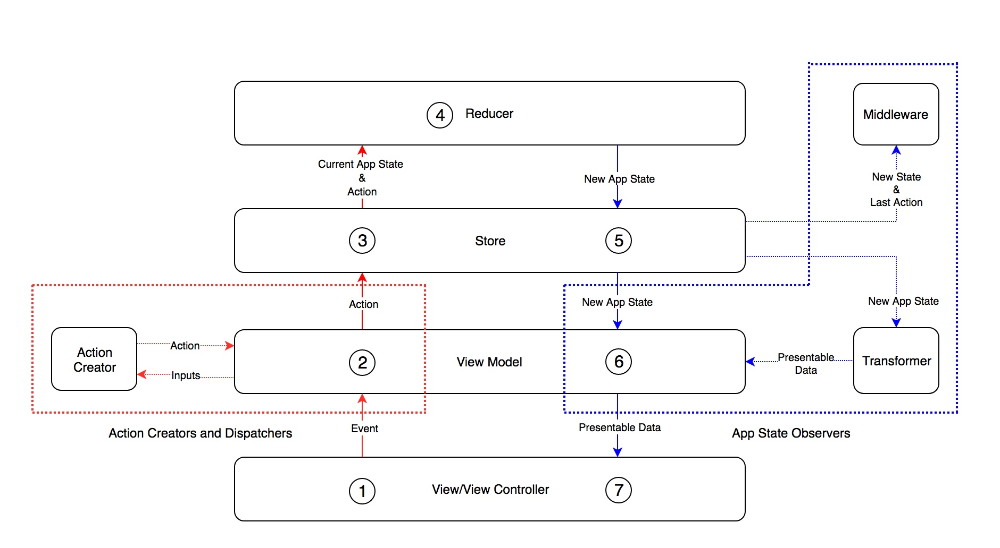

 RxState: Redux + RxSwift
======================================

RxState a predictable state container for Swift apps. It's a tiny library built on top of [RxSwift](https://github.com/ReactiveX/RxSwift) and inspired by [Redux](http://redux.js.org/) that facilitates building [Unidirectional Data Flow](http://redux.js.org/docs/basics/DataFlow.html) architecture.

## Why Unidirectional Data Flow Architecture?

1. Helps you manage state in a consistent and unified way that guaranty it’s always predictable (After all, state is the source of all evil and you wanna keep that evil in check).
2. Limits the way app state can be mutated, which makes your app easier to understand.
3. Makes your code easy to test.
4. Enables faster debugging.
5. It’s is entirely platform independent - you can easily use the same business logic and share it between apps for multiple platforms (iOS, tvOS, etc.).

## Architecture Components

- **App State**: A single **immutable** data structure. It includes the UI state, the navigation state and the state of your model layer. 

- **Store**:Contains the app state and notifies the `App State Observers` of the `App State` updates.

- **Reducer**: A [pure](http://en.wikipedia.org/wiki/Pure_function) function that takes the current app state and an `Action` as input, creates a **new** `App State` that reflects the changes described by the `Action`, and returns the **new** `App State`.

- **Action**: Actions describe a state change. The only way to modified the `App State` is by dispatching `Actions` to the `Store`.

- **Action Creators and Dispatchers**: Creates `Action`s and dispatch them to the store.

- **App State Observers**: Observers the `App State` in the `Store` to transform it to presentable data, write logs, etc.

- **View**: Presents the presentable data that was deriver from the `App State` and delivers the user's interactions to the `Action Creators and Dispatchers`.

## How it works?



1. The `View/View Controller` sends events (The `View Model`'s inputs) to the `View Model`.

2. The `View Model` creates an `Action` from the received inputs and dispatch them to the `Store`.

- The  `View Model` can use a dedicated `Action Creator`s to create `Action`s.
`Action Creator`s do can async work and, based on the results it gets, returns different `Action`s to the `View Model` to dispatch.

3. The `Store` sends the `App State` and the received `Action` to the `Reducer`.

4. The `Reducer` receives the current `App State` and the dispatched `Action`, computes and returns **new** `App State`.

5. The `Store` sends the **new** `App State` to the subscribers.

- One of the subscribers could be a `Middleware` that logs the `App State` resulted from dispatching an `Action`.

6. The `View Model` receives the **new** `App State`, transform it presentable data, and send it to the `View/View Controller`.

- The  `View Model` can use `Transformer`s to transform the `App State` to presentable data. This helps you reuse the transformation code in different `View Model`s.

7. The `View/View Controller` render the UI to show the presentable data to the user.

## How does RxState helps you build the Architecture?

RxState defines the main component for you:

1. `Store`: Contains the `App State` in the form of `Driver<[SubstateType]>`.

2. `SubstateType`: A protocol that tags structs representing a substate.
Ex.

```swift
struct TasksState: SubstateType {   
    var tasks: [Task]
    var addingTask: Bool
}
```

You can add a `Substate`s to the `App State` by dispatching `StoreAction.add(states: [SubstateType])`.

```swift
let tasksState = TasksState()
let action = StoreAction.add(states: [tasksState])
store.dispatch(action: action)
```

3. `ActionType`: A protocol that tags an `Action`. The `Store` has the following `Action`s:

```swift
public enum StoreAction: ActionType {
    /// Adds substates to the application state.
    case add(states: [SubstateType])

    /// Removes all substates in the application state.
    case reset
}
```

4. `MainReducer`: A reducer used by the `Store`'s dispatch function to call the respective reducer based on the Action type.

```swift
let mainReducer: MainReducer = { (state: [SubstateType], action: ActionType) -> [SubstateType] in
    // Copy the `App State`
    var state: [SubstateType] = state
    
    // Cast to a specific `Action`.
    switch action {
    case let action as TasksAction:

        // Extract the `Substate`.
        guard var (tasksStateIndex, tasksState) = state
            .enumerated()
            .first(where: { (_, substate: SubstateType) -> Bool in
                return substate is Store.TasksState}
            ) as? (Int, Store.TasksState)
            else {
                fatalError("You need to register `TasksState` first")
        }

        // Reduce the `Substate` to get a new `Substate`.
        tasksState = Store.reduce(state: tasksState, action: action)
    
        // Replace the `Substate` in the `App State` with the new `Substate`.
        state[tasksStateIndex] = tasksState as SubstateType
    
    default:
        fatalError("Unknown action type")
    }
    
    // Return the new `App State`
    return state
}
```

4. `MiddlewareType`: A protocol defining an object that can observe the `App State` and the last dispatched `Action` and does something with it like logging:

```swift
protocol LoggingMiddlewareType: Middleware, HasDisposeBag {}

final class LoggingMiddleware: LoggingMiddlewareType {
    var disposeBag = DisposeBag()

    func observe(currentStateLastAction: Driver<CurrentStateLastAction>) {
        currentStateLastAction
            .drive(
                onNext: { (currentState: [SubstateType], lastAction: ActionType?) in
                    print(currentState)
                    print(lastAction)
                }, onCompleted: nil, onDisposed: nil)
            .disposed(by: disposeBag)
        }
    }
}
```

## Dependencies

- [RxSwift](https://github.com/ReactiveX/RxSwift) (>= 3.4)
- [RxCocoa](https://github.com/ReactiveX/RxSwift) (>= 3.4)

## Requirements

- Swift 3

## Installation

- **Using [CocoaPods](https://cocoapods.org)**:

```ruby
pod 'RxState'
```

## Demo

I have tried to make the [demo app](https://github.com/nazeehshoura/RxState/tree/development/RxStateExample) as comprehensive as possible. It currently runs on iOS and macOS.
Notice how, because of the architecture, only the View/ View Controller layer needed to change in order to port the app from iOS to macOS.

## Contributing

We would love to see you involved! Feedback and contribution are greatly appreciated :)  Checkout the [Contributing Guide](https://github.com/RxSwiftCommunity/RxState/blob/development/CONTRIBUTING.md) and [Code of Conduct](https://github.com/RxSwiftCommunity/RxState/blob/development/CODE_OF_CONDUCT.md).

## Influences and credits

* [RxSwift](https://github.com/ReactiveX/RxSwift): Reactive Programming in Swift.
* [Redux](http://redux.js.org/): a predictable state container for JavaScript apps.

## Author

Nazih Shoura, shoura.nazeeh@gmail.com

## License

This library belongs to _RxSwiftCommunity_.

RxState is available under the MIT license. See the LICENSE file for more info.
